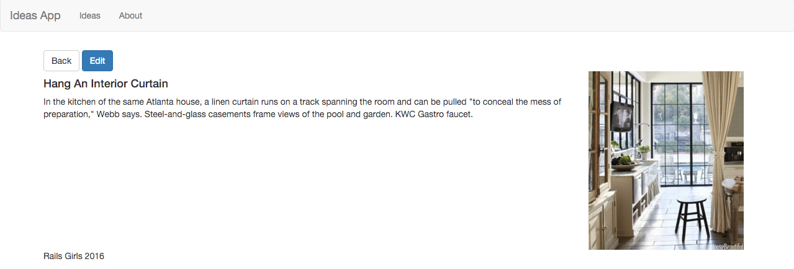

# How To Use Bootstrap Inside Rails App

### Before We Start

I expect you to:

1. Already have Rails installed (no more installations today)
2. Bring your past Idea project files
3. Already have ideas inside the app

If you don't bring your past app files, [download and follow the instructions here](https://github.com/zulhfreelancer/railsgirls).

### Let's Start

1. `cd` into the past project folder. Example: `cd railsgirls`
2. Run `rails server`
3. Open the browser and type `http://localhost:3000`

---

So right now, our idea app looks more or less like this:


And, the single view of the idea looks like this:


### What's Missing Here?

Well, this app works fine. But it lacks something in terms of design. It's not beautiful.

It looks like 90's website, right?

### What We're Going To Create Today?

So today, we're going to make this app looks more nicer and neat. At the end of this tutorial, your ideas index page will looks something like this:


...and your single idea page will looks something like this:



### Notes

At the end of every section, I include a link to Github (_File changes at this stage_) where you can see which lines was removed and which lines was added.

- Red lines = removed (old lines).
- Green lines = added (new lines).

### Step #0 - If You Already Have Bootstrap and Top Navigation Bar

If you already installed Bootstrap gem and add top navigation bar during previous class, you can skip to `Step #3 - Update Ideas Index Page Table`.

### Step #1 - Install Bootstrap Gem

Now, open your `Gemfile` and add this line below `gem 'carrierwave'`:

`gem 'bootstrap-sass', '~> 3.3', '>= 3.3.6'`

Save it.

Now, open `app/assets/stylesheets/` folder and rename the `application.css` to `application.scss` (note the `s` before the `css`).

Open the `application.scss` file and remove these lines:

```
*= require_tree .
*= require_self
```

Now, add these lines below the last star and forward slash (`*/`):

```
@import "bootstrap-sprockets";
@import "bootstrap";
```

Save it.

Next, let's open `app/assets/javascripts/application.js` file and add `//= require bootstrap-sprockets` below the `//= require jquery` line like this:

```
//= require jquery
//= require bootstrap-sprockets
```

And, save it.

Now, open your Terminal and run `bundle install` command.

Then, restart your server by pressing `ctrl + c` and run `rails server` command again.

Now, you'll see a minor change in our app like this:


_Did you notice the text has been changed and no more underlines below the links?_

[File changes at this stage](https://github.com/zulhfreelancer/railsgirls_bootstrap/commit/290761fff7d35a34abf3360cd73f848cde607bcc?diff=unified)

### Step #2 - Update The Top Navigation Bar

Let's open `app/views/layouts/application.html.erb` file and locate this line: `<%= yield %>`.

Now, let's add Bootstrap code before and after the line like this:

```
<div class="container">
  <%= yield %>
</div>
```

Next, let's add this block of code right after the `<body>` tag:

```
<nav class="navbar navbar-default">
  <div class="container-fluid">
    <div class="navbar-header">
      <button type="button" class="navbar-toggle collapsed" data-toggle="collapse" data-target="#bs-example-navbar-collapse-1" aria-expanded="false">
        <span class="sr-only">Toggle navigation</span>
        <span class="icon-bar"></span>
        <span class="icon-bar"></span>
        <span class="icon-bar"></span>
      </button>
      <a class="navbar-brand" href="/">Ideas App</a>
    </div>
    <div class="collapse navbar-collapse" id="bs-example-navbar-collapse-1">
      <ul class="nav navbar-nav">
        <li><a href="/ideas">Ideas</a></li>
        <li><a href="/pages/about">About</a></li>
      </ul>
    </div>
  </div>
</nav>
```

And let's add this block of code below the `<div class="container"> block`:

```
<footer>
  <div class="container">
    Rails Girls 2016
  </div>
</footer>
```

Save the file and refresh your project inside the browser.

You'll see this:


Congratulations, now you've top navigation bar!

[File changes at this stage](https://github.com/zulhfreelancer/railsgirls_bootstrap/commit/8c5c4b2d50615492849ef68c5f21dbf93ce4ddda)

### Step #3 - Update Ideas Index Page Table

Now, let's open `app/views/ideas/index.html.erb` file and locate the `<table>` tag.

We're going to apply [Bootstrap table CSS](http://getbootstrap.com/css/#tables) into this table.

To do that, replace it with `<table class="table">`. Refresh your browser and you'll see this:


_Looks better right?_

Now, let's add something extra. Instead of `<table class="table">`, let's replace it with `<table class="table table-striped">`.

Now, you'll see striped rows table inside your browser like this:


[File changes at this stage](https://github.com/zulhfreelancer/railsgirls_bootstrap/commit/5b169153ec05ec9be118fcb5939da8374fed3416)

### Step #4 - Update Links To Buttons Inside The Table

Let's start by moving the `New Idea` link at the bottom to the top of the page, below the `Listing Ideas` heading like this:

```
<h1>Listing Ideas</h1>
<%= link_to 'New Idea', new_idea_path %>
```

You'll see it like this:


Now, let's add Bootstrap CSS class to make this `New Idea` link looks better.

Add `class: 'btn btn-primary'` inside the New Idea `link_to` tag like this:

`<%= link_to 'New Idea', new_idea_path, class: 'btn btn-primary' %>`

You'll see it like this:


Now, let's do the same thing to the `Show`, `Edit` and `Delete` link.

```
<td><%= link_to 'Show', idea, class: 'btn btn-primary' %></td>
<td><%= link_to 'Edit', edit_idea_path(idea), class: 'btn btn-primary' %></td>
<td><%= link_to 'Destroy', idea, method: :delete, data: { confirm: 'Are you sure?' }, class: 'btn btn-primary' %></td>
```

And, you'll see this:


But... do you think all buttons should be in blue colour? Can we make `Show` button green, `Edit` button orange and `Delete` button red?

Yes we can!

FYI, Bootstrap offers many [colour options for us!](http://getbootstrap.com/css/#buttons-options)

So, let's use them.

- For `Show` button, use `btn btn-success`
- For `Edit` button, use `btn btn-warning`
- For `Delete` button, use `btn btn-danger`

```
<td><%= link_to 'Show', idea, class: 'btn btn-success' %></td>
<td><%= link_to 'Edit', edit_idea_path(idea), class: 'btn btn-warning' %></td>
<td><%= link_to 'Destroy', idea, method: :delete, data: { confirm: 'Are you sure?' }, class: 'btn btn-danger' %></td>
```

And, now you'll see this:


[File changes at this stage](https://github.com/zulhfreelancer/railsgirls_bootstrap/commit/74adb23e394ed092592b2fbd3cb6099e3cbef662)

### Step #5 - Update Single Idea Page

Now, if you click the `Show` button to see single idea page, you'll see this:


We need to edit this page too. So, let's do it together!

#### Understanding How Bootstrap Grid System Works


FYI, Bootstrap has it's own [grid system](http://getbootstrap.com/css/#grid-intro). The structure is like inside the image above.

We only need 1 container. Inside the container, we'll have rows and inside each row, there will be 12 equal width columns (red color).

Total number of columns in a row must always equal to 12.

#### Our Single Idea Page Structure

We have 3 important things to show inside this page:

1. Name
2. Description
3. Picture

Let's put them this way:

```
----------------------------------------------------------------------
| Name											 |                   |
| Description 								     | Picture           |
|              								     |                   |
----------------------------------------------------------------------
```

We're going to put `Name` and `Description` inside left side and put the Picture inside the right side.

For the left side, we're going to put it inside 9 columns and for the right side, we're going to put it inside 3 columns.

---

Now, let's open `app/views/ideas/show.html.erb` file.

Add this block of code after the `<p id="notice"><%= notice %></p>` line (if you've it):

```
<div class="row">
	<div class="col-md-9">
		<h4>Example Name</h4>
		<p>Example description</p>
	</div>
	<div class="col-md-3">
		Picture
	</div>
</div>
```

Now, open your browser and you'll see this:


What we're doing here now is, we're hard-coding a set of example data to see how our Bootstrap grid will looks inside the 9 + 3 columns that we planned earlier.

As you can see above, `Example Name` and `Example description` are both place inside left side (marked `1` and `2`) and `Picture` is placed on the right side (marked `3`).

Now, let's change the example data to Rails code and remove old ones:

Remove this first:

```
<p>
  <strong>Name:</strong>
  <%= @idea.name %>
</p>

<p>
  <strong>Description:</strong>
  <%= @idea.description %>
</p>

<p>
  <strong>Picture:</strong>
  <%= image_tag(@idea.picture_url, :width => 150) if @idea.picture.present? %>
</p>
```
And add this:

```
<div class="row">
	<div class="col-md-9">
		<h4><%= @idea.name %></h4>
		<p><%= @idea.description %></p>
	</div>
	<div class="col-md-3">
		<%= image_tag(@idea.picture_url, :width => 250) if @idea.picture.present? %>
	</div>
</div>
```

You'll get this:


_Looks better right?_

Now, let's change the `Edit` and `Back` button to use Bootstrap CSS and move it to top of the page like this:

```
<%= link_to 'Back', ideas_path, class: 'btn btn-default' %>
<%= link_to 'Edit', edit_idea_path(@idea), class: 'btn btn-primary' %>
```
And, you'll get this:


Yay, now both our index and single idea page looks better! :dancer:

[File changes at this stage](https://github.com/zulhfreelancer/railsgirls_bootstrap/commit/ca54fb4bd920d6f768b8bf2054247e07e2e04f1c)

### Step #6 - Update Idea Form

Now, let's focus on the idea form. If you go to `http://localhost:3000/ideas/new`, you'll see this:


We're going to change this form and apply Bootstrap CSS to make this form looks better.

Let's open `app/views/ideas/_form.html.erb` file.

Find the first `<% end %>` tag and add this block of code below it:

```
<div class="form-group">
	<label>Name</label>
	<input type="text" class="form-control">
</div>
<div class="form-group">
	<label>Description</label>
	<textarea class="form-control" rows="3"></textarea>
</div>
<div class="form-group">
	<label>Picture</label>
	<input type="file">
</div>
<button type="submit" class="btn btn-primary">Save Idea</button>
```

You'll see this:


Just like what we did inside `Update Single Idea Page` step earlier, we're hard-coding the form structure first to see how it's going to look.

As you can see, we now have 4 Bootstrap inputs:

1. Name
2. Description
3. Picture
4. Submit button (let's called it `Save Idea` button)

Let's remove old fields first:

```
<div class="field">
	<%= f.label :name %><br>
	<%= f.text_field :name %>
</div>
<div class="field">
	<%= f.label :description %><br>
	<%= f.text_area :description %>
</div>
<div class="field">
	<%= f.label :picture %><br>
	<%= f.file_field :picture %>
</div>
<div class="actions">
	<%= f.submit %>
</div>
```

And let's update our hard-coded Bootstrap form into this:

```
<div class="form-group">
	<label>Name</label>
	<%= f.text_field :name, class: "form-control" %>
</div>
<div class="form-group">
	<label>Description</label>
	<%= f.text_area :description, rows: 3, class: "form-control" %>
</div>
<div class="form-group">
	<label>Picture</label>
	<%= f.file_field :picture %>
</div>
<%= f.submit "Save Idea", class: "btn btn-primary" %>
```

Now, you'll see this:


[File changes at this stage](https://github.com/zulhfreelancer/railsgirls_bootstrap/commit/172178f67cbb1f87746ffb91654fefd44b40118c)

### Step #7 - Update New and Edit Template Buttons

As you can see above, `Back` link still in plain 'ol style link.

And if you back to ideas index table page and click on any idea `Edit` button, you'll see this:


So, let's turn this links into Bootstrap buttons.

Let's start with `app/views/ideas/new.html.erb` file first.

Make it like this:

```
<%= link_to 'Back', ideas_path, class: 'btn btn-default' %>
<h1>New Idea</h1>
<%= render 'form' %>
```

Now, when you click on `New Idea` button inside the ideas index table page, you'll see this:


Next, let's open `app/views/ideas/edit.html.erb` file and make it like this:

```
<%= link_to 'Back', ideas_path, class: 'btn btn-default' %> <%= link_to 'Show', @idea, class: 'btn btn-success' %>
<h1>Editing Idea</h1>
<%= render 'form' %>
```

Which will give you this result:


[File changes at this stage](https://github.com/zulhfreelancer/railsgirls_bootstrap/commit/e3ab2e41505cd8d315153179de048892309ca527)

### Conclusion

Our app final look:


Congratulations, your Idea app now looks better in Bootstrap! Feel free to explore Bootstrap more and use it inside your Rails projects!

- [Bootstrap CSS](http://getbootstrap.com/css/)
- [Bootstrap Components](http://getbootstrap.com/components/)

You can download full source code of this Bootstrap-ish Idea app [here](https://github.com/zulhfreelancer/railsgirls_bootstrap).

### Prepared by


Zulhilmi Zainudin ([@zulhhandyplast](https://twitter.com/zulhhandyplast)) :v:

24th Jan 2016

Made with :heart: from Kuantan, MY